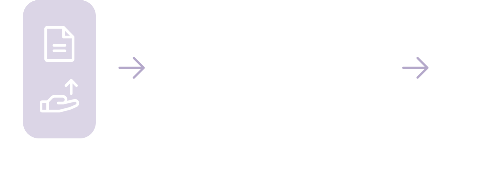
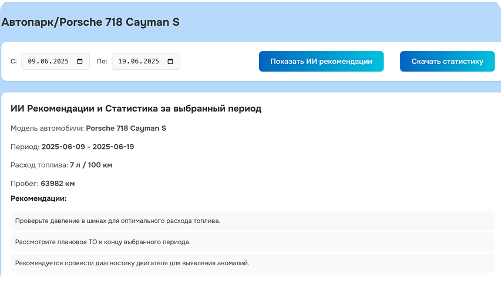
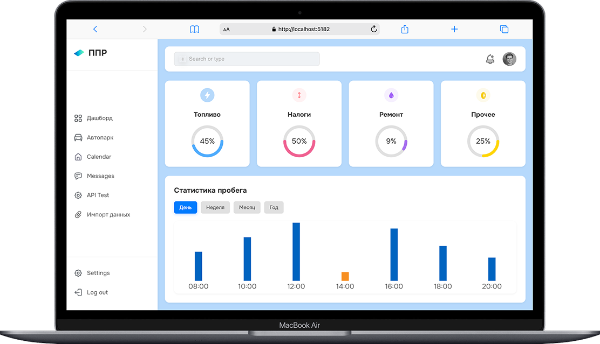
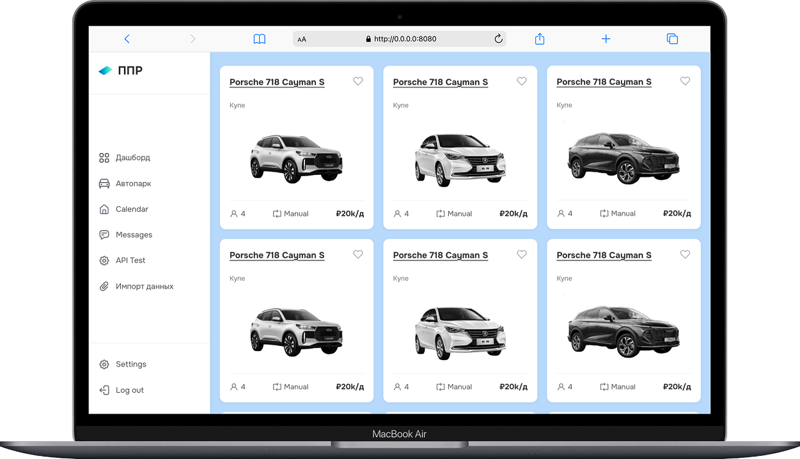

#  Smart Expenses Case

Smart Expenses Case — это современная платформа для управления и анализа расходов автопарка, которая экономит время, снижает издержки и обеспечивает прозрачность бизнес-процессов. Наше решение легко интегрируется, масштабируется и уже готово к промышленной эксплуатации.

---

## 🚀 Быстрый запуск через Docker Compose

```bash
docker-compose up --build
```

---

##  Описание

Платформа включает:
- Веб-интерфейс для мониторинга и аналитики автопарка
- Гибкую загрузку и обработку данных
- Интеграцию с REST API
- Разделение на фронтенд (`dashboard-app`) и бэкенд (`app`) для масштабируемости и надежности

---

## Интеллектуальный анализ расходов

- Для анализа и генерации рекомендаций используется LLM-модель **deepseek-v3**.
- Пример отчёта по анализу расходов доступен в файле [`LLM_doc/Example.pdf`](LLM_doc/Example.pdf).





---

## Фронтенд: современный и удобный интерфейс

- **Технологии:** React, Vite, Recharts, React Router
- **Возможности:**
  - Интерактивные графики и визуализация данных
  - Удобная навигация и адаптивный дизайн
  - Импорт/экспорт данных, drag-and-drop, мгновенная фильтрация
  - Модульная архитектура для легкой доработки






---

## Стилистика и фирменный стиль

- **Шрифт:** Onest Regular (кастомный, современный, легко читается)
- **Дизайн:**
  - Светлый, минималистичный интерфейс сделанный по предоставленному брендбуку
  - Четкие акценты для важных элементов
  - Современные иконки и плавные анимации


---

## Ключевые решения бэкенда

- **Динамические схемы Pydantic**  
  Автогенерация CRUD-схем для исключения дублирования кода.
- **Гибридное удаление**  
  Автоопределение soft/hard delete на основе модели.
- **Умный импорт данных**  
  Адаптивная обработка CSV/XLSX/JSON с автопреобразованием типов и созданием связей.
- **Технологии:** Python 3.11, FastAPI, SQLAlchemy 2.0, PostgreSQL, Docker

---


## Генерация и особенности данных

Для демонстрации возможностей используются синтетические, но реалистичные данные: расходы, характеристики и пробег автомобилей, а также бюджеты. Данные генерируются с учетом сезонности, случайных событий и связности между таблицами. Это позволяет сразу увидеть ценность платформы без необходимости интеграции с реальными системами.

---

##  Примечание

Все названия автомобилей и значения, отображаемые на дашборде, сгенерированы случайным образом и не отражают реальные данные. 

---

## Примеры SQL-запросов для обработки данных

- Общие расходы по категориям за год:
`sql
SELECT c.name AS category, SUM(e.amount) AS total
FROM expenses e
JOIN categories c ON e.category_id = c.id
WHERE strftime('%Y', e.date) = '2024'
GROUP BY c.name
ORDER BY total DESC;
`

- Средний пробег по каждому автомобилю:
`sql
SELECT v.plate_number, v.manufacturer, v.model, v.total_mileage
FROM vehicles v
ORDER BY v.total_mileage DESC;
`

- Процент выполнения плана по бюджету:
`sql
SELECT * FROM monthly_budget WHERE Год = '2024' ORDER BY Процент_от_плана DESC;`

